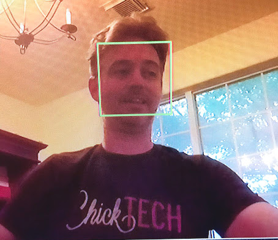

# Raspberry Pi Face Detector

A small python-based OpenCV Haar Cascade frontal face detector for the Raspberry Pi 3 camera module

# Purpose:  
With only 3 libraries (cv2, time and picamera) you can run this!  Very few scripts exist out there that are lean enough with few dependencies to do reasonable facial detection.  Most require you to install bulky libraries or are simply too CPU intensive for a Raspberry Pi.  After installing and trying lots of these scripts (with little or no success) I found two that when merged with some edits will get the job done.  This is basic face detection folks, but it's pretty decent and very tweakable. 

# Code citations:  
- Picamera activation snippet from Adrian's Picamera + OpenCV + Python + Raspberry Pi 
https://www.pyimagesearch.com/2015/03/30/accessing-the-raspberry-pi-camera-with-opencv-and-python/

- Face detection snippet from Shantu's 'webcam_face_detector'
https://github.com/shantnu/Webcam-Face-Detect


# Pre-requisites:  (what I used)
- Raspberry Pi 3 B+   (but if your Pi can run CV2, you'll be fine)
- Camera module V2 (this one:  https://www.raspberrypi.org/products/camera-module-v2/)  
- OS is Rasbian Stretch, latest as of 2018
- CV2 library installed
- PiCamera library installed
- Monitor, mouse, keyboard

# Installing PiCamera library
At your terminal shell, type the following commands:
```
sudo apt-get update
sudo apt-get upgrade
```
Then, follow this with:
```
sudo apt-get update
sudo apt-get install python-picamera python3-picamera
```
You can of course use pip:
```
sudo pip install picamera
```

# Installing CV2
To install CV2 library on Rasbian Stretch, definitely check out Adrian's incredibly detailed install tutorial and buy his book:
https://www.pyimagesearch.com/2017/09/04/raspbian-stretch-install-opencv-3-python-on-your-raspberry-pi/


# How to use this script on Rasbian Stretch
0)  You absolutely MUST have CV2 installed.  To check and see if it is there first enter your python shell:
```
python
```
then type the following commands:
```
import cv2
cv2.__version__
```
This will return the version you are using, the one I used was 3.3.0

<kbd>CTRL</kbd>  <kbd>D</kbd> to exit python.

# Now that the boring stuff is over...

1)  Open a terminal shell, be in your normal users's directory and type the following (edit if desired):
```
cd Downloads
git clone 
```
2)  Change directory into the new folder that was created

3)  Run the script by typing:
```
python rpi_face_detect.py
```

# What SHOULD happen:
Your camera light should turn on and a window will pop up displaying the video feed.  You need to have the FRONT of your face looking into the camera and it will draw a green bounding box around it like the image below.  You can delete this image from the directory, it is not used.




# How to quit
Simply press the 'q' key on the keyboard  <kbd>Q</kbd>

# What's going on, how does this work?
The first thing you might have noticed if you looked at the files in this git is the xml file:  "haarcascade_frontalface_default.xml".  The name sort of says what it does, it contains almost a full megabyte of parameters regarding front-of-face analytics.  This is a pre-baked data file from OpenCV and is used to compare image data you feed it with the call to "faceCascade" in the python script.  There are other Haar Cascade files for different things located here:

https://github.com/opencv/opencv/tree/master/data/haarcascades

In order to understand what's going on with this style of face detection, I highly recommend you read about the OpenCV library and face detection using Haar Cascades:

https://docs.opencv.org/3.0-beta/doc/py_tutorials/py_objdetect/py_face_detection/py_face_detection.html

# To the future and beyond!
If this doesn't work on your device as I've outlined, holler at me through git and let's work on it.  I'm hoping with time I'd like to add the following functionality:
- upon initial detection trigger an action
- upon detection for a specific amount of time, trigger an action


